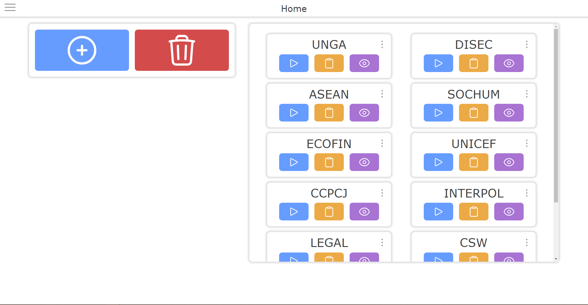

# **‎ MUN PRISM** 
#### ***Model United Nations Platform for Resolution, Integration, Simulation, and Management***

## 👀 **Overview**
PRISM is an open-source web-based service that allows for easier management of Model UN conferences. It makes use of real-time communication and dynamic pages to ensure everyone involved in the running of a conference has the most up-to-date information

## 🌟 **Feature Overview**
1. 📝 [**Committee Management:**](./docs/user/committee_management.md) PRISM allows users to easily create, edit, and delete committees, all synced in real time across clients

2. ⚖️ [**Session Management:**](./docs/user/session_management.md) Committee sessions can be easily managed using PRISM, with users being able to handle motions, caucuses, the agenda, roll call, and various other session-related actions

3. 🕒 [**Live Session Updates:**](./docs/user/live_session_updates.md) Actions taken during committee are communicated in real-time across clients so that everyone has the most up-to-date information on what is transpiring

4. 🔒 [**Advanced Security:**](./docs/user/advanced_security.md) Various security features have been put in place to ensure bad-faith actors can't ruin your conference

## ❗ **Important References**
1. 🤝 [**Code of Conduct:**](./CODE_OF_CONDUCT.md) Before contributing to this project, please review the code of conduct

2. ✍️ [**Contributing:**](./CONTRIBUTING.md) Please also review documentation on proper contributions before contributing to the project

3. 📜 [**License:**](./LICENSE) Finally, please also review the project's license to understand what can and cannot be done with it

4. 🖥️ [**Installation Guide:**](./docs/user/installing.md) The installation guide provides an in-depth explanation on how to run PRISM for your own conference

## 👤 **Attribution**
View a list of all developers who have contributed [here](Contributors.md)

## ✉️ **Contact**
|  | |
|-------------|----------------------------------|
| E-Mail      | nspease16@gmail.com    |
